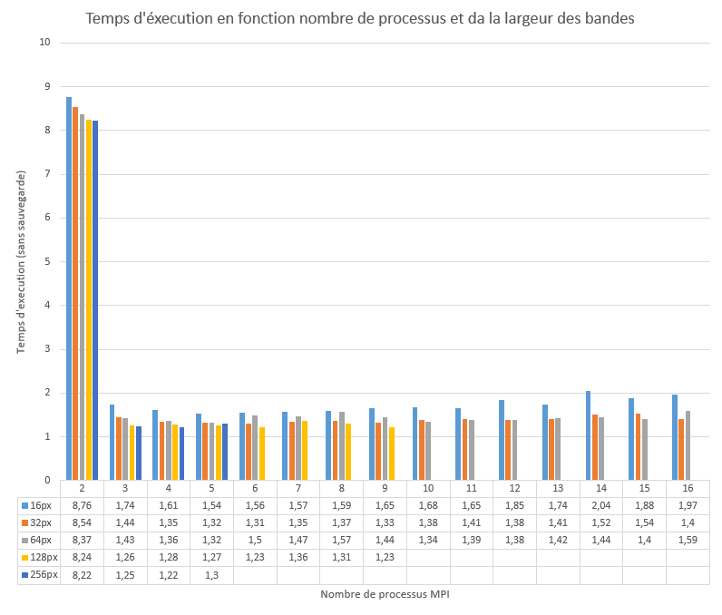

# Projet d'IN203

## Comparaison des méthodes MPI vs CUDA

|      | Simple | Threaded + MPI | Cuda |
|------|--------|-------------------|------|
| real |  10.35 |              1.56 | 0.48 |
| user |  10.32 |             17.34 | 0.14 |
| sys  |   0.00 |              0.17 | 0.35 |

<small>(Le temps réel est celui que l'on considèrera principalement)</small>

Il est évident qu'avec une accélération de l'ordre de la vingtaine CUDA est bien plus efficace que MPI et le multithreading (speedu de 6.6 environs).

Cela s'explique par le de processeurs du GPU et par la facilité de paralléliser par pixel le raytracing.

## Tests des paramètres de la Paraléllisation

Afin d'avoir une meilleur comparaison, on ne va plus enregistrer l'image (accès au disque, long et incompressible). Les paramètre que l'on va faire varier sont le nombre de processus MPI et la taille des tâches (largeur des bandes) à effectuer par les esclaves.

Si la parallélisation (qui commence à partir de 3 processus soit 2 esclaves) est évidemment efficace, l'influence des paramètres est plus subtile. Il semble qu'un petit nombre de processus effectuant des tâches relativement importante est optimal ici.

## Statistiques brutes
#### bandHeight 16
 2 procs : real 8.76 / user 24.46 / sys 0.25 
 3 procs : real 1.74 / user 17.44 / sys 0.26 
 4 procs : real 1.61 / user 17.70 / sys 0.30 
 5 procs : real 1.54 / user 18.27 / sys 0.32 
 6 procs : real 1.56 / user 18.81 / sys 0.33 
 7 procs : real 1.57 / user 19.45 / sys 0.33 
 8 procs : real 1.59 / user 20.13 / sys 0.39 
 9 procs : real 1.65 / user 17.62 / sys 4.02 
10 procs : real 1.68 / user 17.95 / sys 4.22 
11 procs : real 1.65 / user 17.94 / sys 4.24 
12 procs : real 1.85 / user 18.95 / sys 6.04 
13 procs : real 1.74 / user 18.62 / sys 5.37 
14 procs : real 2.04 / user 19.23 / sys 7.56 
15 procs : real 1.88 / user 19.22 / sys 7.20 
16 procs : real 1.97 / user 19.95 / sys 8.00 

#### bandHeight 32
 2 procs : real 8.54 / user 24.47 / sys 0.17 
 3 procs : real 1.44 / user 17.31 / sys 0.16 
 4 procs : real 1.35 / user 17.34 / sys 0.16 
 5 procs : real 1.32 / user 17.58 / sys 0.22 
 6 procs : real 1.31 / user 17.59 / sys 0.22 
 7 procs : real 1.35 / user 18.13 / sys 0.27 
 8 procs : real 1.37 / user 18.58 / sys 0.32 
 9 procs : real 1.33 / user 17.07 / sys 1.44 
10 procs : real 1.38 / user 17.27 / sys 1.63 
11 procs : real 1.41 / user 17.38 / sys 1.74 
12 procs : real 1.38 / user 17.32 / sys 1.99 
13 procs : real 1.41 / user 17.53 / sys 2.00 
14 procs : real 1.52 / user 18.08 / sys 3.12 
15 procs : real 1.54 / user 18.32 / sys 3.20 
16 procs : real 1.40 / user 17.65 / sys 1.84 

#### bandHeight 64
 2 procs : real 8.37 / user 24.34 / sys 0.08 
 3 procs : real 1.43 / user 17.24 / sys 0.10 
 4 procs : real 1.36 / user 17.10 / sys 0.13 
 5 procs : real 1.32 / user 16.98 / sys 0.13 
 6 procs : real 1.50 / user 17.54 / sys 0.21 
 7 procs : real 1.47 / user 17.22 / sys 0.22 
 8 procs : real 1.57 / user 17.92 / sys 0.21 
 9 procs : real 1.44 / user 16.94 / sys 0.87 
10 procs : real 1.34 / user 16.45 / sys 0.88 
11 procs : real 1.39 / user 16.65 / sys 1.31 
12 procs : real 1.38 / user 16.82 / sys 0.98 
13 procs : real 1.42 / user 16.92 / sys 1.56 
14 procs : real 1.44 / user 17.43 / sys 1.39 
15 procs : real 1.40 / user 17.00 / sys 1.14 
16 procs : real 1.59 / user 17.80 / sys 2.98 

#### bandHeight 128
2 procs : real 8.24 / user 24.26 / sys 0.06 
3 procs : real 1.26 / user 17.22 / sys 0.08 
4 procs : real 1.28 / user 17.50 / sys 0.10 
5 procs : real 1.27 / user 17.18 / sys 0.09 
6 procs : real 1.23 / user 17.36 / sys 0.13 
7 procs : real 1.36 / user 17.74 / sys 0.33 
8 procs : real 1.31 / user 17.43 / sys 0.38 
9 procs : real 1.23 / user 17.16 / sys 0.76 

#### bandHeight 256
2 procs : real 8.22 / user 24.32 / sys 0.05 
3 procs : real 1.25 / user 17.21 / sys 0.06 
4 procs : real 1.22 / user 17.38 / sys 0.10 
5 procs : real 1.30 / user 17.54 / sys 0.15 

